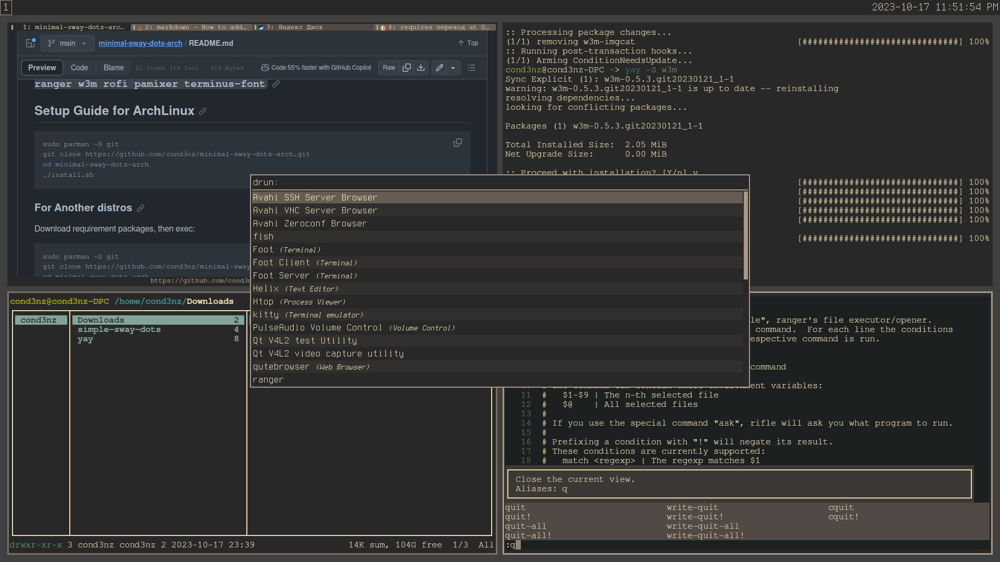
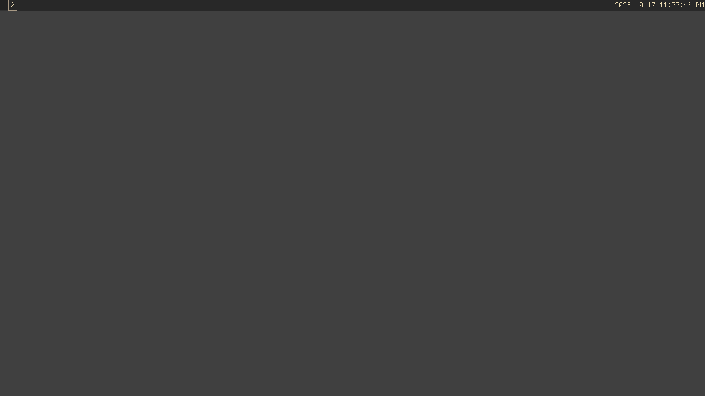

# Minimalistic Sway Dotfiles and install script for archlinux with pipewire.

### This config requires this packages: ```git dunst fish helix kitty xorg-xwayland qutebrowser ranger rofi pamixer terminus-font w3m gtk2 gtk3 qt5-styleplugins qt6gtk2 gtk-engine-murrine gtk-engines```

## Setup Guide for ArchLinux
```sh
sudo pacman -S git
git clone https://github.com/cond3nz/minimal-sway-dots-arch.git
cd minimal-sway-dots-arch
./install.sh
```
### For Another distros
Download requirement packages, then exec:
```sh
git clone https://github.com/cond3nz/minimal-sway-dots-arch.git
cd minimal-sway-dots-arch
cp -rf .config/* ~/.config/
```
## Screenshots


